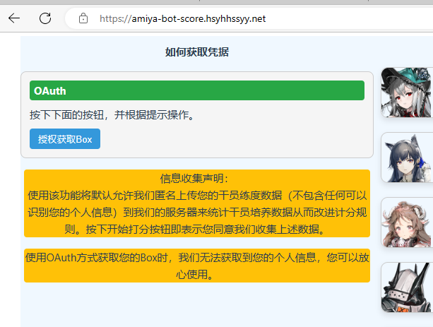
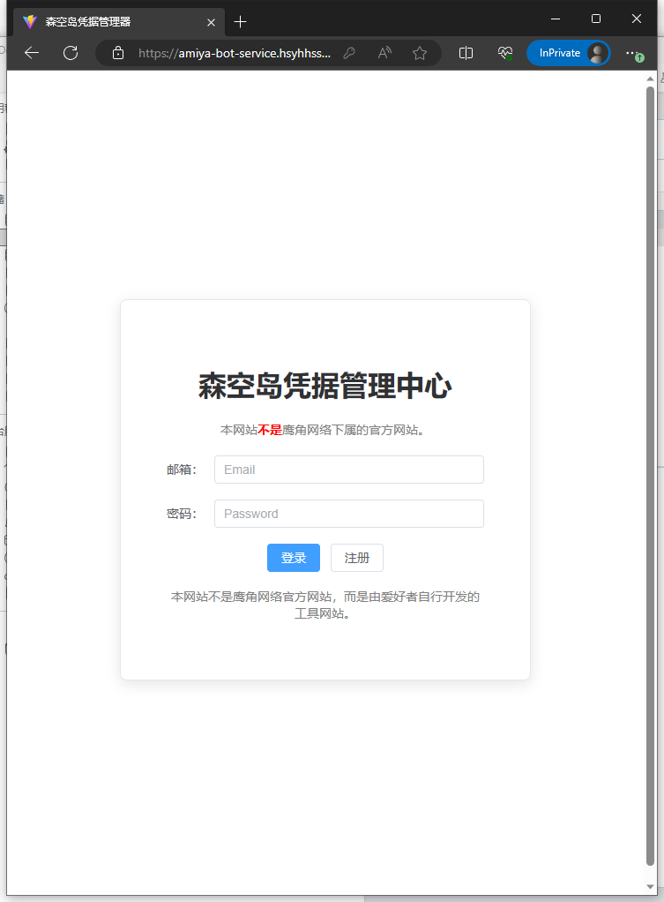
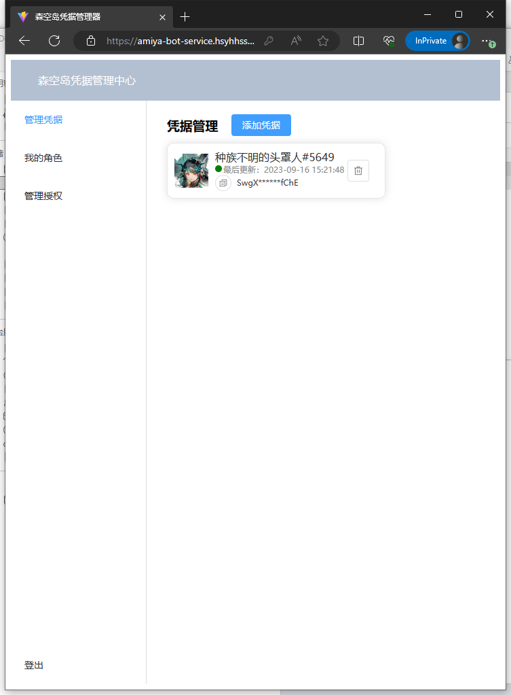
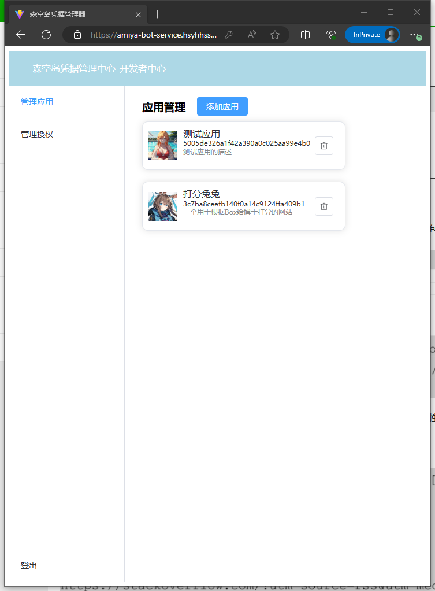
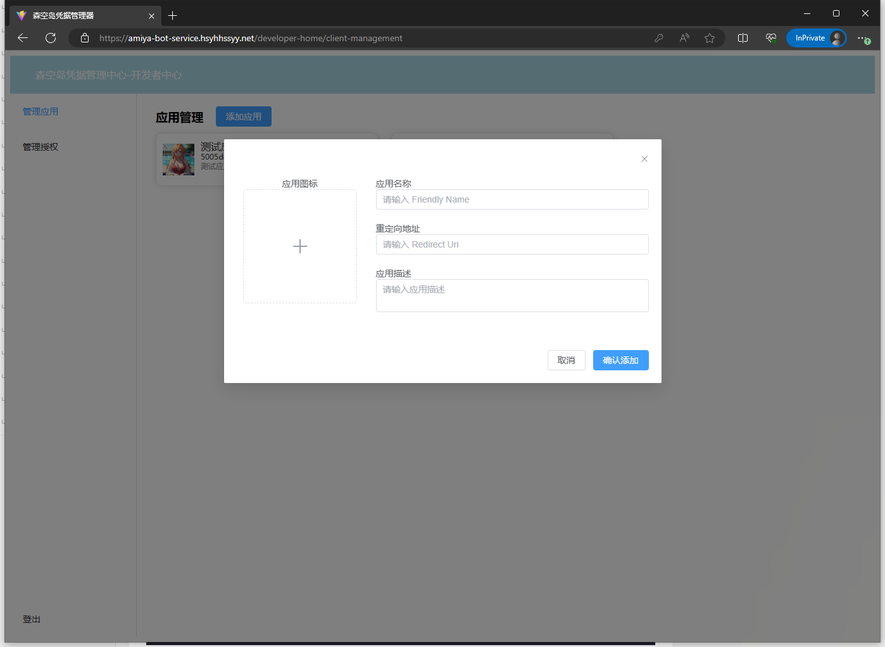
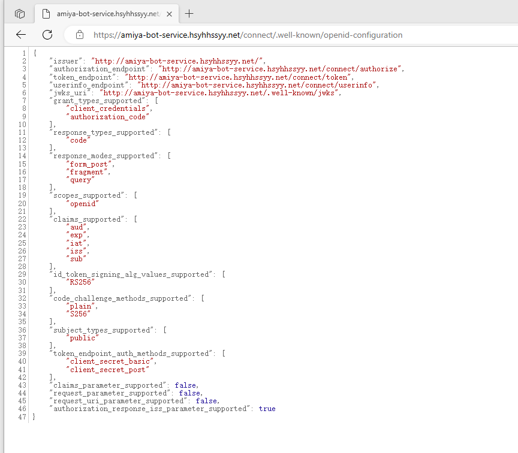

# 兔兔集成角色练度管理系统

## 这是什么？

这个是一个基于标准OAuth2.0协议的森空岛Cred管理器，玩家可以在这里保存他们的Cred。
第三方应用可以通过OAuth的方式申请获取玩家的Box数据，通过这种形式，能够避免泄漏玩家的身份信息。

## 他看起来什么样？

下面用一个例子来描述一下他是如何工作的，你可以去试一试。

[https://amiya-bot-score.hsyhhssyy.net/](https://amiya-bot-score.hsyhhssyy.net/)是我的兔兔打分网站的一个镜像，但是和原始的兔兔打分不一样，他接入了这个系统来获取玩家的Box。

点击授权获取Box按钮，会进入OAuth授权页面。

你可以在这里选择是否同意这个授权，如果你有多个Cred，那么这里还会展示列表让你选择一个。

如果你还没登陆，那么会先要求你登录。

你可以使用如下的演示账户来试一试这个OAuth，当然你也可以自己注册一个。

|  账户名   | 密码  |
|  ----  | ----  |
| amiya@RhodesIsland.com   | cuteAmiya~123 |

<演示账户不可以添加和删除Cred，自己注册的账户则无限制>

按下同意按钮后，系统就跳转回打分网站，并且成功显示出账户的练度。

## 后台管理

这个系统同时拥有一个[管理后台](https://amiya-bot-service.hsyhhssyy.net/)。

普通用户客户登录这个后台管理自己的Cred，而开发者也可以登录这个后台管理自己的应用。

下面是两个演示用账户,可以用于测试，当然你也可以自己注册一个。

|  账户名   | 密码  | 身份  |
|  ----  | ----  | ----   |
| amiya@RhodesIsland.com   | cuteAmiya~123 | 演示用普通用户 |
| closure@RhodesIsland.com   | scaryAmiya~456 | 演示用开发者 |

<演示账户不可以添加和删除Cred与应用，自己注册的账户则无限制>

## 如何接入？

如果你是一个应用开发者，你只需要去注册一个开发者账户，然后在应用管理里添加一个应用。

本系统符合标准的OAuth2.0规范，它的发现地址是：[https://amiya-bot-service.hsyhhssyy.net/connect/.well-known/openid-configuration](https://amiya-bot-service.hsyhhssyy.net/connect/.well-known/openid-configuration)

所以你可以像接入Github OAuth等任何OAuth那样来接入本系统，网上有很多相关教程，暂时不再赘述。
不过，使用authorization_code模式OAuth验证的一个例子，可以在兔兔打分的repo中看到，这也就是上面演示用的代码。

[OAuthGetBox.vue](https://github.com/hsyhhssyy/amiyabot-player-rating-standalone/blob/master/src/views/OAuthGetBox.vue)